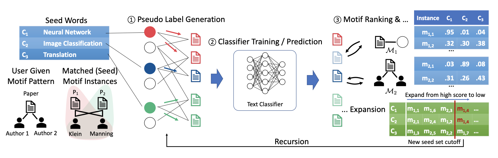

# META: Metadata-Empowered Weak Supervision for Text Classification

- [Model](#model)
- [Training](#training)
	- [Required Inputs](#required-inputs)
	- [Commands](#commands)
	- [Requirements](#requirements)
- [Citation](#citation)

## Model



## Training

### Required inputs
Each Dataset should contain following files:
- **DataFrame pickle file**
  - Example: ```data/books/df.pkl```
    - This dataset can contain any number of columns but must contain two columns named ```text```, ```label```
    - ```text``` contains text and ```label``` contains its corresponding label.
    - Must be named as ```df.pkl```
- **Seed Words Json file**
  - Example: ```data/books/seedwords.json```
    - This json file contains seed words list for each label.
    - Must be named as ```seedwords.json```
- **Metadata config file**
  - Example: ```data/books/metadata_config.json```
    - This json file contains metadata type as key and there must be `separator` in the values which indicates
    the separator of that entry in the dataframe.
    - If no separator is required, the value for `separator` should be `null`. 
    - For example, if authors information are provided as a comma-separated string, the `separator` should be `","`.
- **Motif Patterns file**
  - Example: ```data/books/motif_patterns.txt```
    - This text file contains one motif pattern per line.
    - A motif pattern is represented as comma-separated string. For example: `authors, authors` represents 
    co-authorship.

### Commands

 #### META - Iterative Framework:
The ```train.sh``` requires five arguments in the following order: 
- ```use_gpu```: indicates whether to use GPU. This should be set to 1 to use GPU and 0 to use CPU.
- ```GPU```: refers to GPU id.
- ```dataset_path```: refers to absolute path of dataset.
- ```tmp_path```: refers to a path to a temporary directory which is used for dumping intermediate files.
- ```print_flag```: indicates whether to print the expanded phrases and motif instances. This should be set to 1
to print and 0 to not print. 

For example, to train META on books dataset on GPU Id 4, please run:
```shell script
$ ./train.sh 1 4 <DATA_PATH TO BOOKS> <TEMP_DIR PATH> 1
```

### Requirements

This project is based on ```python==3.7```. The dependencies are as follow:
```
keras==2.1.5
scikit-learn==0.21.3
scipy=1.3.1
gensim==3.8.1
numpy==1.17.2
fast-pagerank==0.0.4
tensorflow==1.15
nltk
bleach==3.1.5
pandas
beautifulsoup4
```

## Citation

```
@inproceedings{mekala-etal-2020-meta,
    title = "{META}: Metadata-Empowered Weak Supervision for Text Classification",
    author = "Mekala, Dheeraj  and
      Zhang, Xinyang  and
      Shang, Jingbo",
    booktitle = "Proceedings of the 2020 Conference on Empirical Methods in Natural Language Processing (EMNLP)",
    month = nov,
    year = "2020",
    address = "Online",
    publisher = "Association for Computational Linguistics",
    url = "https://www.aclweb.org/anthology/2020.emnlp-main.670",
    doi = "10.18653/v1/2020.emnlp-main.670",
    pages = "8351--8361",
    abstract = "Recent advances in weakly supervised learning enable training high-quality text classifiers by only providing a few user-provided seed words. Existing methods mainly use text data alone to generate pseudo-labels despite the fact that metadata information (e.g., author and timestamp) is widely available across various domains. Strong label indicators exist in the metadata and it has been long overlooked mainly due to the following challenges: (1) metadata is multi-typed, requiring systematic modeling of different types and their combinations, (2) metadata is noisy, some metadata entities (e.g., authors, venues) are more compelling label indicators than others. In this paper, we propose a novel framework, META, which goes beyond the existing paradigm and leverages metadata as an additional source of weak supervision. Specifically, we organize the text data and metadata together into a text-rich network and adopt network motifs to capture appropriate combinations of metadata. Based on seed words, we rank and filter motif instances to distill highly label-indicative ones as {``}seed motifs{''}, which provide additional weak supervision. Following a bootstrapping manner, we train the classifier and expand the seed words and seed motifs iteratively. Extensive experiments and case studies on real-world datasets demonstrate superior performance and significant advantages of leveraging metadata as weak supervision.",
}
```